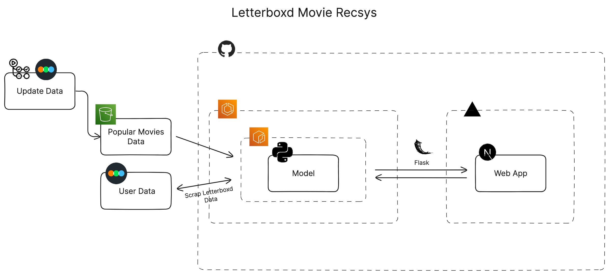
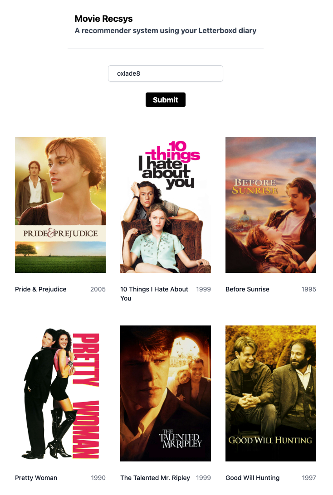

# Letterboxd Recsys - A Next Js Web app with a Recommender System

This project is a robust web application built with Next.js, complemented by a powerful Recommender System. Powered by AWS services and deployed via Vercel and GitHub, this system boasts of a vast tech stack.

**Table of Contents**
1. [Design](#design)
2. [Project Structure](#project-structure)
3. [How It Works](#how-it-works)
4. [Technology Stack](#technology-stack)
5. [Deployment](#deployment)

## Design

<p align="center">
  
</p>

## Project Structure

The root-level directory of the project contains the main Next.js web application with the associated React and Tailwind files. Along with this, a dedicated Recommender System is compartmentalized within the 'recommender-system' folder.

```
.
├── Web App Files
└── recommender-system
    ├── Python Code
    ├── Dockerfile
    └── Modules
```

-   **Web App Files**: This is the frontend of the application built using Next.js, React, and Tailwind.
-   **recommender-system**: This directory contains all the codes and files related to the Recommender System. It includes scripts written in Python, Dockerfile, and several modules.

## How It Works

The **recommender system** used in this project employs a basic form of **content filtering technique**. It utilizes data scraped from Letterboxd, a platform for movie reviews. Since there isn't a public API available for Letterboxd, **web scraping** was the chosen method.

Our system generates movie recommendations by comparing a user's **past reviews** with the **popular movies** on Letterboxd. It also merges additional features taken from the **TMDB API** into this comparison. In essence, the system learns both from a user's historical preferences and the trending choices among the broader Letterboxd community in order to suggest relevant movies.

To ensure our system is always using the most current data, we have a **GitHub Action** set up. This action routinely updates our **dataset** in an **AWS S3 bucket** with the latest popular movies from Letterboxd.

Upon a recommendation request (which requires a username as input), the system applies the model to generate a list of six movies. The selected movies are popular ones that show the closest match to a user's taste, as derived from their past reviews.

Here are how the results look like : 

<p align="center">
  
</p>

## Technology Stack

The tech stack used in this project involves a blend of languages, libraries, tools, and cloud services:

-   Languages and Libraries: Python Beautifulsoup, scikitLearn, Pandas, Aiohttp, Pypeeteer, Flask), JavaScript (Next.js, React)
-   Backend Storage and Processing: AWS S3, AWS ECS, AWS Lambda
-   Containerization: Docker and ECR
-   Automating : GitHub Actions
-   UI: Tailwind CSS
-   Deployment: Vercel

## Deployment

The project uses Vercel for seamless deployment of the Next.js web-app, while AWS ECR (Elastic Container Registry) is used for Docker images that encapsulate our recommend system. Any changes to code are automatically detected by the in-place Vercel Features, which triggers necessary redeployments.

To utilize this service, one environment variable is required: the TMDB API key. This API key is freely obtainable.
